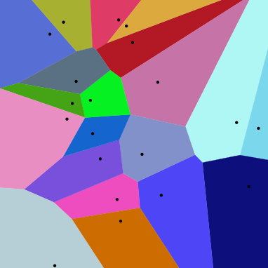
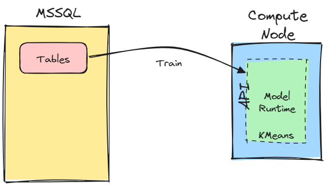

# Azure SQL DB Vector - KMeans Compute Node

Perform Approximate Nearest Neighbor (ANN) search on a vector column in Azure SQL DB using KMeans clustering.

As KMeans clustering is a compute intensive operation, this project uses SciKit Learn library to perform the clustering and stores the results in a SQL DB table. The results are then used to perform ANN search on the vector column.

To make the integration with SQL DB seamless, this project uses Azure Container Apps and expose the KMeans clustering as a REST API. The entire repository can be deployed to Azure using the [free services](https://azure.microsoft.com/en-us/pricing/free-services):


Vector data is stored in Azure SQL with no additional dependencies as shown in this repository: https://github.com/Azure-Samples/azure-sql-db-openai. The same dataset is used also in this project.

Azure SQL database can be used to easily and quickly perform vector similarity search. There are two options for this: a native option and a classic option.

The **native option** is to use the new Vector Functions, recently introduced in Azure SQL database. Vector Functions are a set of functions that can be used to perform vector operations directly in the database. 

> [!NOTE]  
> Vector Functions are in Early Adopter Preview. Get access to the preview via https://aka.ms/azuresql-vector-eap-announcement


The **classic option** is to use the classic T-SQL to perform vector operations, with the support for columnstore indexes for getting good performances.

> [!IMPORTANT]  
> This branch (the `main` branch) uses the native vector support in Azure SQL. If you want to use the classic T-SQL, switch to the `classic` branch.

If you want to experiment locally, the project [can be fully run locally](#run-the-project-locally) using [Dev Container](https://code.visualstudio.com/docs/devcontainers/containers) and Docker.

## Table of Contents

- [Vector Search Optimization](#vector-search-optimization-via-voronoi-cells-and-inverted-file-index-aka-cell-probing)
- [Architecture](#architecture)
- [Run the project locally](#run-the-project-locally)
- [Deploy the project to Azure](#deploy-the-project-to-azure)
- [Use the REST API](#rest-api)
- [Search for similar vectors](#search-for-similar-vectors)
- [Performances](#performances)
- [Adding a new vector](#adding-a-new-vector)

## Vector Search Optimization via Voronoi Cells and Inverted File Index (aka "Cell-Probing")

Given a vector, finding the most similar vector among all those stored in a database is a common problem in many applications. The easiest approach to solve this problem is to use a brute force approach, which is to compute the distance between the query vector and all the vectors stored in the database. This is a good approach when the number of vectors is not extremely big, and dimensionality of vectors is not very high, as it guarantees *perfect [recall](https://en.wikipedia.org/wiki/Precision_and_recall)*, meaning that all relevant items that should be returned are actually returned.

Unfortunately this approach is not scalable as the number of vectors stored in the database increases, so you may want to exchange a perfect recall for much better performances. This is where *approximate nearest neighbor* (ANN) search comes into play. ANN search algorithms are able to return the most similar vectors to the query vector, but they do not guarantee perfect recall. In other words, they may return less vectors than all the relevant to the query vector, but they are much faster than the brute force approach.

To speed up the search, it is possible to split the vectors into groups, making sure the create groups so that all vectors that are someone similar to each other are put in the same group. This is the idea behind *Voronoi cells*. 



The idea is to create a set of *centroids* (i.e. vectors) and then assign each vector to the closest centroid. This way, all vectors that are similar to each other will be assigned to the same centroid. This is a very fast operation, as it is just a matter of computing the distance between the vector and all the centroids and then assign the vector to the closest centroid. Once all vectors are assigned to a centroid, it is possible to create a *inverted file index* that maps each centroid to the list of vectors assigned to it. This way, when a query vector is given, it is possible to find the closest centroid and then return all the vectors assigned to it. This is much faster than computing the distance between the query vector and all the vectors stored in the database.

This project uses KMeans clustering to create the centroids and then create the inverted file index. KMeans clustering is a very popular clustering algorithm that is able to create a given number of clusters (i.e. centroids) by iteratively moving the centroids to the center of the vectors assigned to them. The number of clusters is a parameter that can be tuned to trade off recall and performances. The more clusters are created, the better the recall, but the slower the search. The less clusters are created, the worse the recall, but the faster the search.

In this repo the number of cluster is determined by the following code:

```python
if (vector_count > 1000000):
    clusters = int(math.sqrt(vector_count))
else:
    clusters = int(vector_count / 1000) * 2 
```

## Architecture

The architecture of the project is very simple as it is composed of a single container that exposes a REST API to build and rebuild the index and to search for similar vectors. The container is deployed to Azure Container Apps and uses Azure SQL DB to store the vectors and the clusters. 

The idea is that compute intensive operations, like calculating KMeans, can be offloaded to dedicated container that is easy to deploy, quick to start and  offers serverless scaling for the best performance/cost ratio.



Once the container is running it is completely independent from the database and can do its work without affecting database performances at all. Even better, if more scalability is needed, data can be partitioned across multiple container instances to achieve parallelism


Once the model has been trained, the identified clusters and centroids - and thus the IVF index - are saved back to the SQL DB so that they can be used to perform ANN search on the vector column without the need for the container to remain active. If fact, the container can be stopped completely as SQL DB is completely autonomous now.


The data stored back into SQL DB using the following tables:

- `[$vector].[kmeans]`: stores information about created indexes
- `[$vector].[<table_name>$<column_name>$clusters_centroids]`: stores the centroids
- `[$vector].[<table_name>$<column_name>$clusters]`: the IVF structure, associating each centroid to the list of vectors assigned to it

to make the search even easier a function is created also:

- `[$vector].[find_similar$<table_name>$<column_name>](<vector>, <probe cells count>, <similarity threshold>)`: the function to perform ANN search

The function calculates the dot product which is the same as the cosine similarity if vectors are normalized to 1.

Also the function:

- `[$vector].[find_cluster$<table_name>$<column_name>](<vector>)`: find the cluster of a given vector

is provided as it is needed to insert new vectors into the IVF index.

## Run the project locally

The project take advantage of [Dev Container](https://code.visualstudio.com/docs/devcontainers/containers) to run the project locally. Make sure to have Docker Desktop installed and running on your machine.

Clone the repository and open it in VS Code. You'll be prompted to reopen the project in a Dev Container. Click on the "Reopen in Container" button. The Dev Container sets up the container needed to run Scikit Learn and also the SQL DB needed to store the vectors and the clusters. 

A database named `vectordb` is created automatically along with the `dbo.wikipedia_articles_embeddings` table. 

You can use [Azure Data Studio](https://learn.microsoft.com/en-us/azure-data-studio/download-azure-data-studio) to connect to the SQL DB and run queries against it.

### Import sample dataset

Follow the instructions in the `/sample-data` folder to download the sample dataset. Once the `vector_database_wikipedia_articles_embedded.csv` is available you can import it into the MSSQL database using the script 

- `src/sql/00-import-data.sql`

and then create the supporting table to store vector values in an expanded columnstore format:

- `src/sql/02-create-support-table.sql`

Attention: if you want to use a table of yours instead of the provided sample dataset, please make sure the the columns names in the supporting table are 

- `item_id`
- `vector_value_id`
- `vector_value`

### Run the application

From a VS Code terminal, run the following command:

```bash
cd src
uvicorn main:api
```

and you'll be good to go. The API will be available at http://127.0.0.1:8000.

You can now run the KMeans clustering algorithm using the commands as described in the [REST API](#rest-api) section.

## Deploy the project to Azure

Deployment to Azure is done using [AZD CLI](https://learn.microsoft.com/azure/developer/azure-developer-cli/install-azd).

### Install AZD CLI

You need to install it before running and deploying with the Azure Developer CLI.

On Windows:

```powershell
powershell -ex AllSigned -c "Invoke-RestMethod 'https://aka.ms/install-azd.ps1' | Invoke-Expression"
```

On Linux/MacOS:

```bash
curl -fsSL https://aka.ms/install-azd.sh | bash
```

After logging in with the following command, you will be able to use azd cli to quickly provision and deploy the application.

### Authenticate with Azure

Make sure AZD CLI can access Azure resources. You can use the following command to log in to Azure:

```bash
azd auth login
```

### Deploy the database

Follow the steps defined in the [Azure SQL DB OpenAI](https://github.com/Azure-Samples/azure-sql-db-openai?tab=readme-ov-file#download-and-import-the-wikipedia-article-with-vector-embeddings) repository to deploy the database and import the sample dataset. And the end of the process you'll have a table named `dbo.wikipedia_articles_embeddings` with the vector data.

Then use the following script

- `src/sql/01-create-user.sql`

to create a user that will be used by Python to access the database.

and then create the supporting table to store vector values in an expanded columnstore format

- `src/sql/02-create-support-table.sql`

Attention: if you want to use a table of yours instead of the provided sample dataset, please make sure the the columns names in the supporting table are 

- `item_id`
- `vector_value_id`
- `vector_value`

### Deploy the application

Initialize the Azure Developer CLI with the following command:

```bash
azd init
```

and then set the `MSSQL` variable to the connection string pointing to the Azure SQL DB:

```bash
azd env set MSSQL 'Server=tcp:<server name>.database.windows.net,1433;Initial Catalog=<database name>;Persist Security Info=False;User ID=<user id>;Password=<password>;'
```

finally deploy the application to Azure with the following command:

```bash
azd up
```

after a few minutes the container will be deployed into an Azure Container Apps and ready to accept requests.

## REST API

KMeans model from Scikit Learn is executed within a container as a REST endpoint. The API exposed by the container are:

- Server Status: `GET /`
- Build Index: `POST /kmeans/build`
- Rebuild Index: `POST /kmeans/rebuild`

Both Build and Rebuild API are asynchronous. The Server Status API can be used to check the status of the build process. 

### Build Index

To build an index from scratch, the Build API expects the following payload:

```
{
  "table": {
    "schema": <schema name>,
    "name": <table name>
  },
  "column": {
    "id": <id column name>,
    "vector": <vector column name>
  },
  "vector": {
    "dimensions": <dimensions>
  }
}
```

Using the aforementioned wikipedia dataset, the payload would be:

```http
POST /kmeans/build
{
  "table": {
    "schema": "dbo",
    "name": "wikipedia_articles_embeddings"
  },
  "column": {
    "id": "id",
    "vector": "content_vector"
  },
  "vector": {
    "dimensions": 1536
  }
}
```

The API would verify that the request is correct and then start the build process asynchronously returning the id assigned to the index being created:

```
{
  "id": 1,
  "status": {
    "status": {
      "current": "initializing",
      "last": "idle"
    },
    "index_id": "1"
  }
}
```

And index on the same table and vector column already exists, the API would return an error. If you want to force the creation of a new index over the existing one you can use the `force` option:

```http
POST /kmeans/build?force=true
```

### Rebuild Index

If you need to rebuild an existing index, you can use the Rebuild API. The API doesn't need a payload as it will use the existing index definition. Just like the build process, also the rebuild process is asynchronous. The index to be rebuilt is specified via URL path:

```
POST /kmeans/rebuild/<index id>
```

for example, to rebuild the index with id 1:

```http
POST /kmeans/rebuild/1
```

### Query API Status

The status of the build process can be checked using the Server Status API:

```http
GET /
```

and you'll get the current status and the last status reported:

```json
{
  "server": {
    "status": {
      "current": "building",
      "last": "initializing"
    },
    "index_id": 1
  },
  "version": "0.0.1"
}
```

Checking the last status is useful to understand if an error occurred during the build process.

You can also check the index build status by querying the `[$vector].[kmeans]` table.

## Search for similar vectors

Once you have built the index, you can search for similar vectors. Using the sample dataset, you can search for the 10 most similar articles to 'Isaac Asimov' using the `find_similar` function that has been created as part of the index build process. For example:

```sql
-- Store the vector representing 'Isaac Asimov' in a variable
declare @v nvarchar(max);
select @v = content_vector from dbo.wikipedia_articles_embeddings where title = 'Isaac Asimov';

-- Find the 10 most similar articles to 'Isaac Asimov' based on the title vector
-- searching only in the closest cluster
select top (10) * from [$vector].find_similar$wikipedia_articles_embeddings$content_vector(@v, 1, 0.75) order by dot_product desc
```

The `find_similar` function takes 3 parameters:

- the vector to search for
- the number of clusters to search in
- the similarity threshold

The similarity threshold is used to filter out vectors that are not similar enough to the query vector. The higher the threshold, the more similar the vectors returned will be. The number of clusters to search in is used to speed up the search. The higher the number of clusters, the more similar the vectors returned will be. The lower the number of clusters, the faster the search will be.

## Performances

As visible in this gif, the performance improvement is quite substantial. The gif shows the execution of the `find_similar` function with different number of probed clusters. 


## Adding a new vector

To add a new vector to the index, you can use the `find_cluster` function to find the cluster of the new vector and then insert the vector into the corresponding cluster. A full example is provided in the `src/sql/06-add-new-vector.sql` script.

Adding a new vector to the index can deteriorate the quality of the index as new centroids are not calculated, so it is recommended to rebuild the index after adding a significant number of new vectors, to create new centroids and reassign the vectors to the new centroids.

## References

The Voronoi Cells image is from Wikipedia: https://en.wikipedia.org/wiki/Voronoi_diagram#/media/File:Euclidean_Voronoi_diagram.svg, used under the [CC BY-SA 4.0 DEED](https://creativecommons.org/licenses/by-sa/4.0/) license.